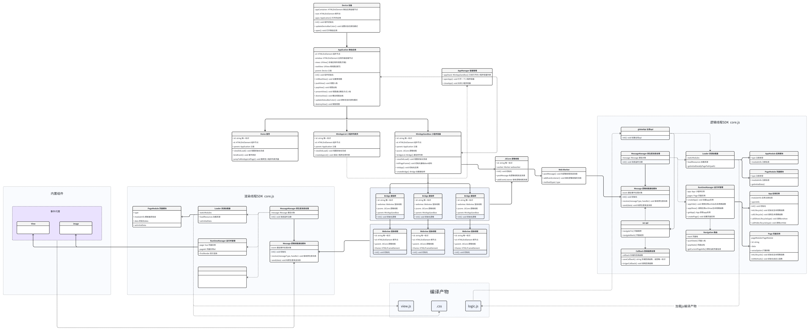
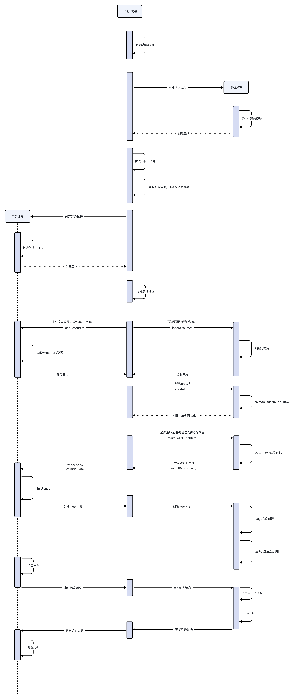

# 原生应用小程序底层运行框架

## 演示

<iframe 
    src="//player.bilibili.com/player.html?aid=1852981596&bvid=BV1rp42197TD&cid=1496575000&p=1" 
    scrolling="no" 
    border="0" 
    frameborder="no" 
    framespacing="0"
    allowfullscreen="true"
>
</iframe>

## UML

## 小程序运行过程

